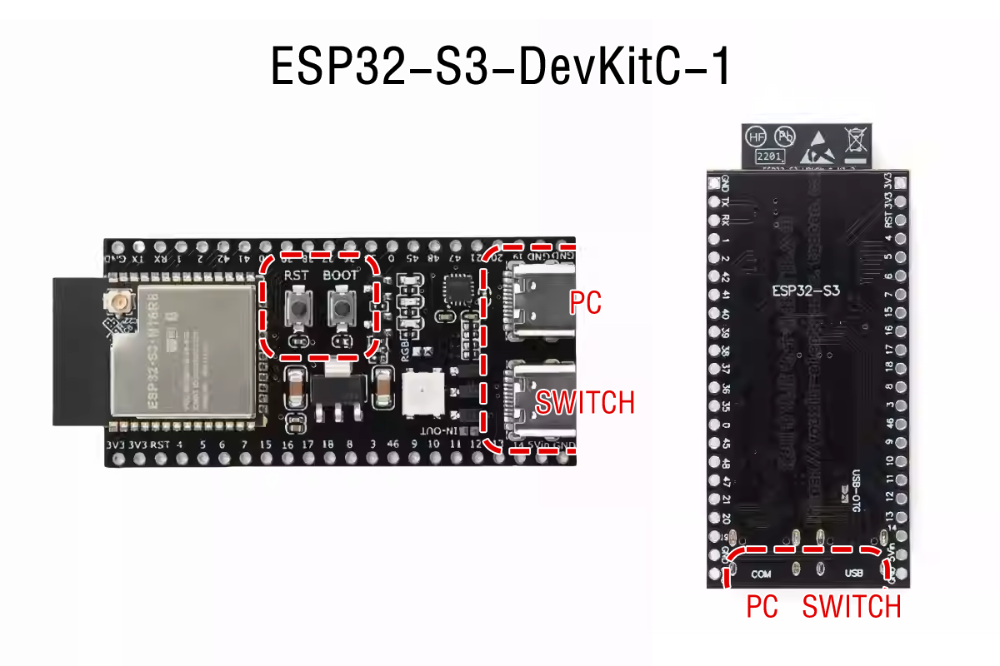
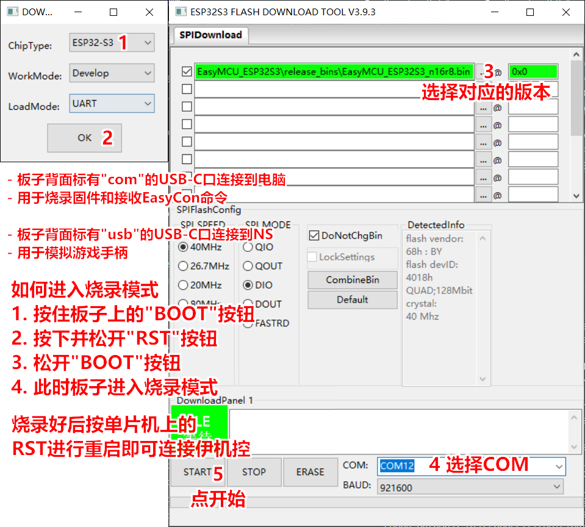

# EasyMCU_ESP32S3

## 项目概述

EasyMCU_ESP32S3是一个基于ESP32-S3开发板的游戏手柄模拟项目，通过串口接收命令来模拟游戏手柄的按键动作。

## 支持的硬件版本

- **已测试版本**：ESP32-S3-DevKitC-1 N16R8
- **其他版本**：n8r2, n8r8（需要自行编译，不保证能用）

## 硬件连接

1. **电脑连接**：
   - 板子背面标有"com"的USB-C口连接到电脑
   - 用于烧录固件和接收EasyCon命令

2. **Switch连接**：
   - 板子背面标有"usb"的USB-C口连接到Nintendo Switch
   - 用于模拟游戏手柄

## 烧录指南

### 固件路径

项目根目录下的 `/release_bins/` 文件夹

### 固件文件列表

- `EasyMCU_ESP32S3_n16r8.bin` - 适用于 ESP32-S3-DevKitC-1 N16R8（已测试）
- `EasyMCU_ESP32S3_n8r2.bin` - 适用于 ESP32-S3-DevKitC-1 N8R2 版本（需自行测试）
- `EasyMCU_ESP32S3_n8r8.bin` - 适用于 ESP32-S3-DevKitC-1 N8R8 版本（需自行测试）

### 进入烧录模式
1. 按住板子上的"BOOT"按钮
2. 按下并松开"RST"按钮
3. 松开"BOOT"按钮
4. 此时板子进入烧录模式

### 烧录软件推荐

- **ESP Flash Download Tool**：[官方下载链接](https://www.espressif.com/en/support/download/other-tools)
  - 选择"ESP32-S3"作为芯片类型
  - 选择固件文件
  - 地址设置为"0x0"
  - 选择COM
  - 点击"Start"开始烧录

## 使用方法

1. **安装EasyCon软件**：从 [EasyCon 官方 GitHub 仓库](https://github.com/EasyConNS/EasyCon) 下载并安装软件
2. **连接设备**：
   - 通过标有"com"的USB-C口将ESP32连接到电脑
   - 通过标有"usb"的USB-C口将ESP32连接到Nintendo Switch
3. **配置EasyCon**：
   - 在EasyCon软件中选择ESP32的COM端口
   - 配置按键映射和其他设置
4. **开始使用**：
   - 通过EasyCon软件发送命令
   - ESP32会模拟游戏手柄的按键动作

## 调试日志

如果需要查看调试日志：
1. 将CH341A模块连接到ESP32的UART1：
   - CH341A的TXD接ESP32的GPIO18（RX1）
   - CH341A的RXD接ESP32的GPIO17（TX1）
   - CH341A的GND接ESP32的GND
2. 使用串口助手打开CH341A的COM端口，波特率设置为115200，8N1
3. 观察ESP32的启动日志和运行状态

## 注意事项

- 只测试了ESP32-S3-DevKitC-1 N16R8版本
- 其他版本需要自行编译，不保证能用
- 烧录时请确保正确进入烧录模式
- 使用时请确保硬件连接正确，避免短路

## 故障排查

- **无法进入烧录模式**：请检查按键操作顺序是否正确
- **烧录失败**：请检查USB连接是否稳定，尝试更换USB线缆
- **游戏手柄未被识别**：请检查USB连接，确保ESP32正确连接到Nintendo Switch
- **EasyCon命令无响应**：请检查COM端口设置，确保波特率为115200
- **调试日志无输出**：请检查CH341A与ESP32的UART1连接

## 免责声明

本项目仅供学习和研究使用，使用本项目产生的任何后果由使用者自行承担。